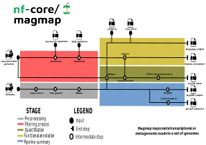

<h1>
  <picture>
    <source media="(prefers-color-scheme: dark)" srcset="docs/images/nf-core-magmap_logo_dark.png">
    
  </picture>
</h1>

[](https://github.com/nf-core/magmap/actions/workflows/ci.yml)
[](https://github.com/nf-core/magmap/actions/workflows/linting.yml)[](https://nf-co.re/magmap/results)[](https://doi.org/10.5281/zenodo.XXXXXXX)
[](https://www.nf-test.com)

[](https://www.nextflow.io/)
[](https://docs.conda.io/en/latest/)
[](https://www.docker.com/)
[](https://sylabs.io/docs/)
[](https://cloud.seqera.io/launch?pipeline=https://github.com/nf-core/magmap)

[](https://nfcore.slack.com/channels/magmap)[](https://twitter.com/nf_core)[](https://mstdn.science/@nf_core)[](https://www.youtube.com/c/nf-core)

## Introduction

**nf-core/magmap** is a bioinformatics best-practice analysis pipeline for mapping reads to a (large) collections of genomes.

The pipeline is built using [Nextflow](https://www.nextflow.io), a workflow tool to run tasks across multiple compute infrastructures in a very portable manner. It uses Docker/Singularity containers making installation trivial and results highly reproducible. The [Nextflow DSL2](https://www.nextflow.io/docs/latest/dsl2.html) implementation of this pipeline uses one container per process which makes it much easier to maintain and update software dependencies. Where possible, these processes have been submitted to and installed from [nf-core/modules](https://github.com/nf-core/modules) in order to make them available to all nf-core pipelines, and to everyone within the Nextflow community!



1. Read QC ([`FastQC`](https://www.bioinformatics.babraham.ac.uk/projects/fastqc/))
2. Present QC for raw reads ([`MultiQC`](http://multiqc.info/))
3. Quality trimming and adapters removal for raw reads ([`Trim Galore!`](https://www.bioinformatics.babraham.ac.uk/projects/trim_galore/))
4. Filter reads with [`BBduk`](https://sourceforge.net/projects/bbmap/)
5. Select reference genomes based on k-mer signatures in reads with [`sourmash`](https://sourmash.readthedocs.io/en/latest/)
6. Quantification of genes identified in selected reference genomes:
   1. generate index of assembly ([`BBmap index`](https://sourceforge.net/projects/bbmap/))
   2. Mapping cleaned reads to the assembly for quantification ([`BBmap`](https://sourceforge.net/projects/bbmap/))
   3. Get raw counts per each gene present in the genomes ([`Featurecounts`](http://subread.sourceforge.net)) -> TSV table with collected featurecounts output
7. Summary statistics table. Collect_stats.R

## Usage

> [!NOTE]
> If you are new to Nextflow and nf-core, please refer to [this page](https://nf-co.re/docs/usage/installation) on how to set-up Nextflow. Make sure to [test your setup](https://nf-co.re/docs/usage/introduction#how-to-run-a-pipeline) with `-profile test` before running the workflow on actual data.

First, prepare a samplesheet with your input data that looks as follows:

`samplesheet.csv`:

```csv
sample,fastq_1,fastq_2
CONTROL_REP1,AEG588A1_S1_L002_R1_001.fastq.gz,AEG588A1_S1_L002_R2_001.fastq.gz
CONTROL_REP2,AEG588A1_S2_L002_R1_001.fastq.gz,AEG588A1_S2_L002_R2_001.fastq.gz
```

Each row represents a fastq file (single-end) or a pair of fastq files (paired end).

And, if you want to map to a set of your own genomes, a genome information file looking like this:

`genomeinfo.csv`:

```csv
accno,genome_fna,genome_gff
genome1,path/to/fna.gz,path/to/gff.gz
genome2,path/to/fna.gz,path/to/gff.gz
genome3,path/to/fna.gz,path/to/gff.gz
```

Each row represents a genome file with or without the paired gff

Now, you can run the pipeline using:

```bash
nextflow run nf-core/magmap --input samplesheet.csv --genomeinfo genomeinfo.csv --outdir <OUTDIR> -profile <docker/singularity/podman/shifter/charliecloud/conda/institute>
```

:::warning
Please provide pipeline parameters via the CLI or Nextflow `-params-file` option. Custom config files including those
provided by the `-c` Nextflow option can be used to provide any configuration _**except for parameters**_;
see [docs](https://nf-co.re/usage/configuration#custom-configuration-files).
:::

For more details and further functionality, please refer to the [usage documentation](https://nf-co.re/magmap/usage) and the [parameter documentation](https://nf-co.re/magmap/parameters).

## Pipeline output

To see the results of an example test run with a full size dataset refer to the [results](https://nf-co.re/magmap/results) tab on the nf-core website pipeline page.
For more details about the output files and reports, please refer to the
[output documentation](https://nf-co.re/magmap/output).

## Credits

nf-core/magmap was originally written by Danilo Di Leo [@danilodileo](https://github.com/danilodileo), Emelie Nilsson [@emnillson](https://github.com/emnilsson) and Daniel Lundin [@erikrikardaniel](https://github.com/erikrikarddaniel).

## Contributions and Support

If you would like to contribute to this pipeline, please see the [contributing guidelines](.github/CONTRIBUTING.md).

For further information or help, don't hesitate to get in touch on the [Slack `#magmap` channel](https://nfcore.slack.com/channels/magmap) (you can join with [this invite](https://nf-co.re/join/slack)).

## Citations

<!-- TODO nf-core: Add citation for pipeline after first release. Uncomment lines below and update Zenodo doi and badge at the top of this file. -->
<!-- If you use nf-core/magmap for your analysis, please cite it using the following doi: [10.5281/zenodo.XXXXXX](https://doi.org/10.5281/zenodo.XXXXXX) -->

An extensive list of references for the tools used by the pipeline can be found in the [`CITATIONS.md`](CITATIONS.md) file.

You can cite the `nf-core` publication as follows:

> **The nf-core framework for community-curated bioinformatics pipelines.**
>
> Philip Ewels, Alexander Peltzer, Sven Fillinger, Harshil Patel, Johannes Alneberg, Andreas Wilm, Maxime Ulysse Garcia, Paolo Di Tommaso & Sven Nahnsen.
>
> _Nat Biotechnol._ 2020 Feb 13. doi: [10.1038/s41587-020-0439-x](https://dx.doi.org/10.1038/s41587-020-0439-x).
